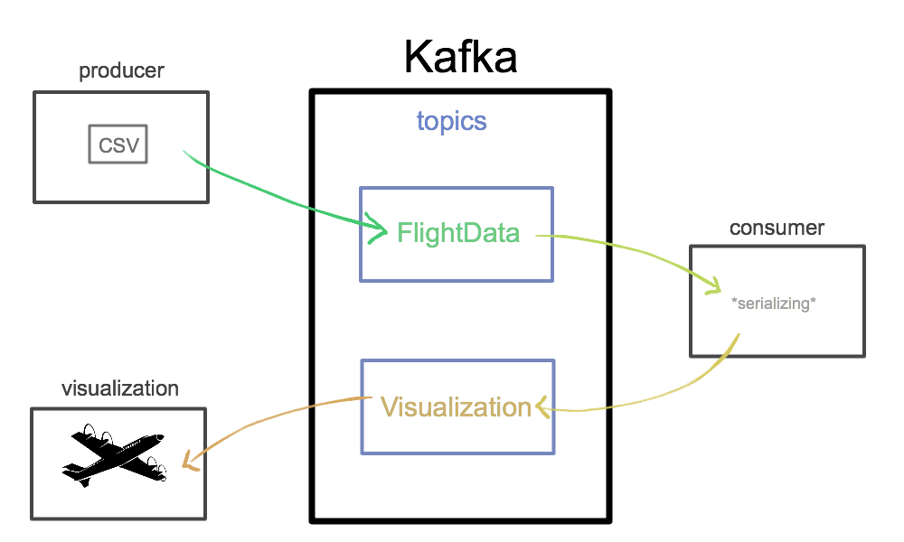

# innovative-project-jackdaw

[](https://travis-ci.org/nokia-wroclaw/innovative-project-jackdaw)


## Table of contents

1. Project goals
2. Technologies
3. Functionality of modules
4. Installation
5. Contributors


## 1. Project goals

The goal was to create PoC for platform performing streaming calculation using **Kafka** and **Docker** in microservice architecture.

This platform allows to perform Big Data Calculation in Streaming mode. 

For the final product a web application responsible for data visualization has been created.



We used a [dataset](https://www.kaggle.com/ramirobentes/flights-in-brazil) representing flights from and to Brasil as an example.


## 2. Technologies

* [Docker](https://www.docker.com)
* [Apache Kafka](https://kafka.apache.org)
   * [Confluent Schemat Registry](https://docs.confluent.io)
* Java 8
* JavaScript
   * [Leaflet](https://leafletjs.com)
   * [jQuery](https://jquery.com)
   * [socket.io](https://socket.io)
   * [node.js](https://nodejs.org)
* [Maven](http://maven.apache.org)
* [Travis Cl](https://travis-ci.org)


## 3. Functionality of modules

This project consists of three main modules:

* Producer
   * reads data from file
   * sends messages serialized by `KafkaAvroSerializer` to the `FlightData` topic on Kafka
* Consumer

   * reads data from `FlightData` topic
   * uses `KafkaAvroDeserializer`
   * converts data into a geoJSON
   * sends it to `Visualization` topic on Kafka

* Visualization
   * **consumer** - reads data from `Visualization` topic and constantly sends data with socket
   * **flight visualization** - receives data with socket and provides live visualization on map


* Charts
   * visualize flight delays for airlines


Every module has its defined environment – a separate docker image defined in Dockerfile.

Docker-compose allows to build and run all the services together.

This solution provides containers with all required dependencies installed.


## 4. Installation

### Preparing Docker environment
First you need to have [Docker](https://docs.docker.com/install) installed on your system.
Then run docker or create and start docker machine.

### Clone the repository
Open a command prompt and use the following commands to clone repository and navigate to project directory:
```bash
$ git clone https://github.com/nokia-wroclaw/innovative-project-jackdaw.git
$ cd innovative-project-jackdaw
```
### Run
Run docker-compose
```bash
$ docker-compose up
```
or 
```bash
$ ./run.sh
```

### Stop
```bash
$ docker-compose down
```

or in order to clear Jackdaw images:

```bash
$ ./clear.sh
```

If everything went right, you should be able to access:

* map visualization at `localhost:3001`


* charts visualization at `localhost:3000`


## 5. Contributors
Students
* [Anna Antończak](https://github.com/ankanna)
* [Kacper Bieganek](https://github.com/KacperBieganek)
* [Krzysztof Buczak](https://github.com/buczaq)
* [Hanna Grodzicka](https://github.com/hvvka)
* [Mateusz Najda](https://github.com/mnajda)

Nokia Supervisors
* Paweł Ślawski
* [Dawid Rutowicz](https://github.com/dawrut)
* [Damian Czaja](https://github.com/Trojan295)
* Ewa Kaczmarek
