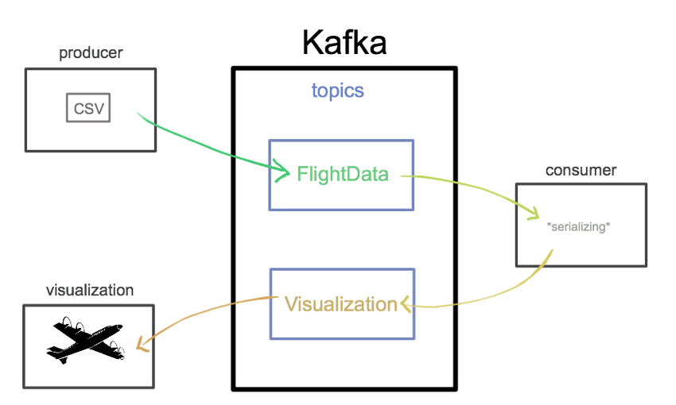

# Project goals

---------

The goal was to create PoC for platform performing streaming calculation using **Kafka** and **Docker** in microservices architecture. 

---------

This platform allows to perform Big Data Calculation in Streaming mode. 

For the final product a web application responsible for data visualization has been created.

---------

---------

We used a [dataset](https://www.kaggle.com/ramirobentes/flights-in-brazil) representing flights from and to Brasil as an example.
