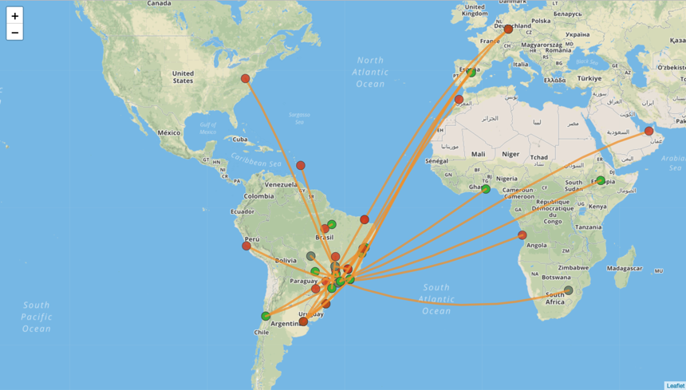

# Functionality of modules

-----------

### Project consists of 3 components

* Producer

* Consumer

* Visualization

-----------

## Producer

* reads data from file

* sends messages serialized by `KafkaAvroSerializer` 
to the `FlightData` topic on Kafka

-----------

## Consumer

* reads data from `FlightData` topic

* uses `KafkaAvroDeserializer`

* converts data into a GeoJSON

* sends it to `Visualization` topic on Kafka

-----------

## Visualization

* **consumer** - reads data from `Visualization` topic
 and sends data to browser through socket

* **flight visualization** - receives data from socket
 and provides live visualization on map

-----------

-----------

-----------

-----------

## Charts 

* visualize flight delays for airlines

-----------

-----------

-----------

Every module has its definied environment – a seperate docker image defined in Dockerfile, which creates container. 

-----------

Docker-compose allows to build and run all the services together.

This solution provides containers with all required dependencies installed.

